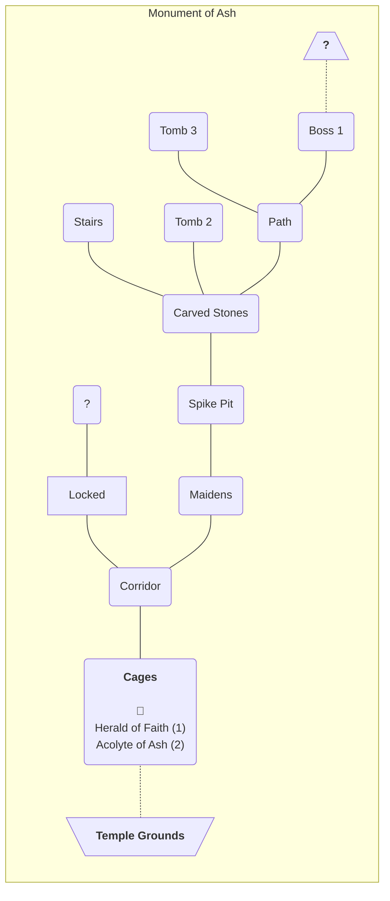

```mermaid
graph BT
  in[\<b>Temple Grounds</b>/]
  1("
    <b>Cages</b>

    👿
    Herald of Faith (1)
    Acolyte of Ash (2)
    ")
  2(Corridor)
  3(?)
  4(Maidens)
  5(Spike Pit)
  6(Carved Stones)
  7(Stairs)
  8(Tomb 2)
  9(Path)
  10(Tomb 3)
  11(Boss 1)
  out[/<b>?</b>\]

  subgraph "Monument of Ash"
    direction BT
    in -.- 1
    1 --- 2
    2 --- Locked --- 3
    2 --- 4
    4 --- 5
    5 --- 6
    6 --- 8
    6 --- 7
    6 --- 9
    9 --- 10
    9 --- 11
    11 -.- out

  click in "https://github.com/OzLocke/mortal_shell_map/blob/main/temple_grounds.md" "View Temple Grounds map"
  click out "https://github.com/OzLocke/mortal_shell_map/blob/main/?.md" "View ? map"
  end

```

