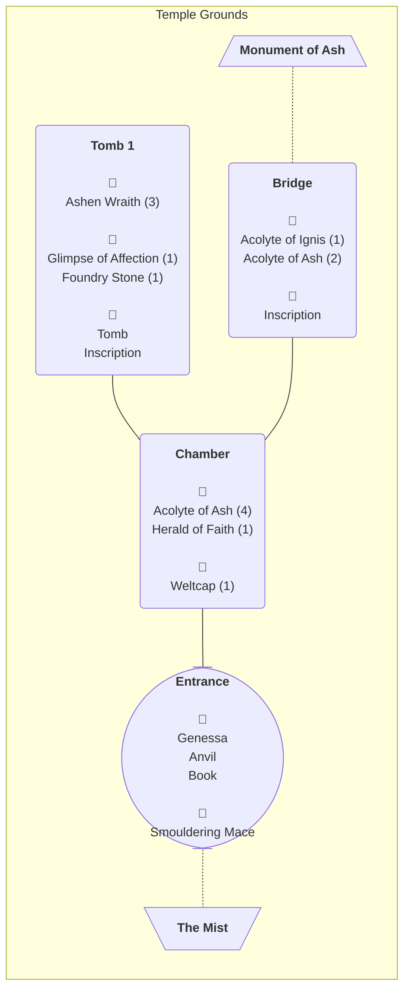

```mermaid
graph BT
 
  in[\<b>The Mist</b>/]
  1(["
    <b>Entrance</b>

    💬
    Genessa
    Anvil
    Book

    🎁
    Smouldering Mace
    "])
  2("
    <b>Chamber</b>

    👿
    Acolyte of Ash (4)
    Herald of Faith (1)
    
    🎁
    Weltcap (1)
    ")
  3("
    <b>Tomb 1</b>

    👿
    Ashen Wraith (3)

    🎁
    Glimpse of Affection (1)
    Foundry Stone (1)
    
    💬
    Tomb
    Inscription
    ")
  4("
    <b>Bridge</b>
    
    👿
    Acolyte of Ignis (1)
    Acolyte of Ash (2)

    💬
    Inscription
    ")
  out[/<b>Monument of Ash</b>\]
  
  subgraph "Temple Grounds"
    direction BT
    in -.- 1
    1 --- 2
    2 --- 3
    2 --- 4
    4 -.- out
  
  click in "./the_mist.md"
  click out "./momument_of_ash.md"
  end
  
```